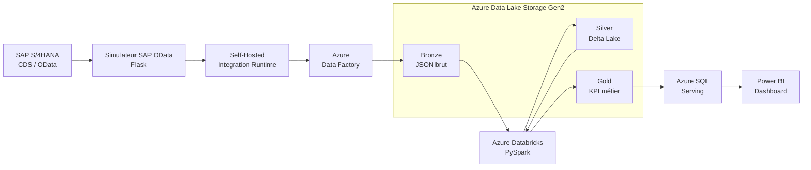
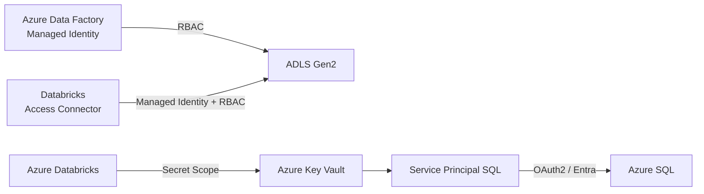

# 01 — Architecture de la plateforme SAP Data Engineering

## 1. Objectif architectural

Ce projet met en œuvre une plateforme Data Engineering permettant d'extraire, transporter, transformer, contrôler et exposer 
des données provenant d'un environnement SAP simulé.

L'objectif n'est pas uniquement de déplacer des données vers Azure. L'architecture doit également répondre à plusieurs 
problématiques rencontrées dans les plateformes Data modernes :

- connectivité avec une source SAP située hors du Cloud ;
- ingestion orchestrée ;
- conservation des données sources ;
- transformations distribuées ;
- qualité des données ;
- traitement incrémental ;
- idempotence ;
- traçabilité ;
- séparation des couches techniques et métier ;
- sécurisation des accès ;
- exposition des données aux outils analytiques ;
- Infrastructure as Code.

L'architecture retenue s'appuie sur une approche Lakehouse et sur le modèle Medallion **Bronze / Silver / Gold**.

---

## 2. Vue d'ensemble



Le pipeline suit donc le chemin fonctionnel suivant :

```text
SAP / OData
     ↓
Self-Hosted Integration Runtime
     ↓
Azure Data Factory
     ↓
ADLS Gen2 — Bronze
     ↓
Azure Databricks / PySpark
     ↓
Delta Lake — Silver
     ↓
Data Quality + MERGE + Idempotence
     ↓
Delta Lake — Gold
     ↓
Azure SQL
     ↓
Power BI
```

---

## 3. Couche source — SAP / OData

Le projet reproduit les concepts d'une extraction SAP S/4HANA sans nécessiter un système SAP commercial.

Les premières étapes ont permis d'étudier plusieurs objets et concepts SAP :

- Business Partners ;
- Sales Orders ;
- en-têtes et postes de commandes ;
- matériaux ;
- clés métier ;
- clés composites ;
- relations entre objets SAP.

Des identifiants de type SAP tels que `VBELN`, `POSNR` et `MATNR` sont manipulés comme des chaînes 
afin de préserver leur représentation fonctionnelle, notamment les éventuels zéros initiaux.

Un serveur Flask simule ensuite une API SAP OData.

L'API reproduit plusieurs mécanismes importants :

```text
$select
$filter
$expand
$top
$skip
@odata.nextLink
```

Cette couche permet de reproduire un scénario d'intégration proche d'une extraction SAP exposée par API.

---

## 4. Couche de connectivité hybride — Self-Hosted IR

L'API SAP/OData simulée fonctionne dans l'environnement local.

Azure Data Factory ne peut donc pas simplement accéder à cette source comme à une ressource Azure native.

Le **Self-Hosted Integration Runtime (SHIR)** joue le rôle de pont entre le réseau local et Azure Data Factory.

```text
Flask / OData
      │
      │ HTTP
      ▼
Self-Hosted Integration Runtime
      │
      │ connexion sortante
      ▼
Azure Data Factory
```

Cette architecture reproduit un cas d'entreprise dans lequel SAP est hébergé :

- on-premise ;
- dans un datacenter privé ;
- ou dans un réseau qui n'est pas directement exposé à Azure.

Le SHIR permet donc à ADF d'orchestrer le transfert sans transformer la source SAP en service publiquement accessible.

---

## 5. Couche d'ingestion — Azure Data Factory

Azure Data Factory assure l'orchestration de l'ingestion.

Le pipeline principal est :

```text
pl_sap_sales_orders_to_bronze
```

Il utilise notamment :

```text
ls_sap_odata_local
        ↓
ds_sap_sales_orders_http
        ↓
copy_sap_sales_orders_to_bronze
        ↓
ds_bronze_sales_orders_json
        ↓
ls_adls_sap
```

Le flux réel validé pendant le LAB est :

```text
SAP/OData HTTP
      ↓
SHIR
      ↓
ADF Copy Activity
      ↓
ADLS Gen2
      ↓
Bronze
```

ADF est utilisé ici comme moteur d'orchestration et de mouvement de données.

Les transformations Data Engineering complexes sont volontairement confiées à Databricks/PySpark plutôt qu'à la Copy Activity.

Cette séparation permet d'attribuer une responsabilité claire à chaque composant.

---

## 6. Couche de stockage — ADLS Gen2

Azure Data Lake Storage Gen2 constitue le stockage central de la plateforme.

Trois filesystems ont été utilisés :

```text
bronze
silver
gold
```

Cette séparation matérialise l'architecture Medallion.

### Bronze

La couche Bronze conserve les données aussi proches que possible de la représentation source.

Exemple :

```text
bronze/
└── sap/
    └── sales_orders/
        └── sales_orders.json
```

Objectifs :

- conserver la donnée source ;
- assurer la traçabilité ;
- permettre un replay ;
- découpler ingestion et transformation.

### Silver

La couche Silver contient les données :

- parsées ;
- typées ;
- nettoyées ;
- validées ;
- dédupliquées.

Elle utilise Delta Lake afin de bénéficier notamment des transactions ACID et de l'opération `MERGE`.

### Gold

La couche Gold contient des données orientées métier et consommation analytique.

Le projet produit notamment :

```text
customer_kpi
currency_kpi
daily_kpi
```

La couche Gold ne doit donc plus être considérée comme une simple copie technique de SAP : 

elle représente une vue métier dérivée des données validées.

---

## 7. Couche de traitement — Azure Databricks et PySpark

Azure Databricks fournit l'environnement de calcul utilisé pour les transformations.

PySpark est utilisé pour :

- lire les données Bronze ;
- parser le JSON ;
- appliquer un schéma ;
- convertir les types ;
- appliquer les règles de qualité ;
- détecter les doublons ;
- produire Silver ;
- traiter les données incrémentales ;
- calculer les agrégations Gold.

Le traitement peut être représenté ainsi :

```text
Bronze JSON
    ↓
PySpark
    ↓
Schema enforcement
    ↓
Data Quality
    ↓
Silver Delta
    ↓
Incremental MERGE
    ↓
Gold Aggregations
```

Databricks est donc principalement responsable de la **transformation et de la fiabilité de la donnée**, 

tandis qu'ADF reste responsable de son ingestion et de son orchestration.

---

## 8. Traitement incrémental

Une plateforme Data Engineering ne doit pas nécessairement retraiter l'ensemble des données à chaque exécution.

Le projet implémente donc un mécanisme incrémental basé sur :

```text
LastChangeDateTime
```

Le principe est :

```text
Dernier watermark
      ↓
OData $filter
      ↓
LastChangeDateTime > watermark
      ↓
Nouvelles données / données modifiées
      ↓
Traitement
      ↓
Nouveau watermark
```

Cette stratégie a d'abord été validée localement avec SQLite avant d'être transposée aux mécanismes Delta.

Elle réduit la quantité de données retraitées et constitue une base pour des pipelines de plus grande échelle.

---

## 9. Delta Lake MERGE et idempotence

Les données incrémentales sont intégrées à Silver grâce à `MERGE`.

Le principe est :

```text
Source incrémentale
        ↓
Comparaison par SalesOrder
        ↓
┌───────────────────┬───────────────────┐
│ clé existante     │ nouvelle clé      │
│                   │                   │
│ UPDATE            │ INSERT            │
└───────────────────┴───────────────────┘
        ↓
Silver Delta
```

Un scénario de test a notamment permis :

- de mettre à jour la commande `50000002` ;
- d'ajouter la commande `50000006`.

Après le `MERGE`, Silver contient six commandes.

Le même batch a ensuite été rejoué.

Résultat :

```text
Lignes avant replay : 6
Lignes après replay : 6
Doublons             : 0

PASS
```

Le pipeline démontre ainsi une propriété essentielle : **l'idempotence**.

Une reprise ou un rejeu ne doit pas créer de duplication fonctionnelle.

---

## 10. Data Quality

Les contrôles qualité sont appliqués avant que les données soient considérées comme fiables pour la consommation métier.

Le projet couvre notamment :

- unicité des clés ;
- clés composites ;
- doublons ;
- références orphelines ;
- matériaux inconnus ;
- quantités invalides ;
- montants invalides ;
- valeurs nulles ;
- cohérence du schéma ;
- cohérence des types.

La validation Databricks finale a obtenu :

```text
7 / 7 contrôles Data Quality : PASS
```

La qualité des données n'est donc pas traitée comme une vérification manuelle après le pipeline : elle fait partie 
du traitement Data Engineering.

---

## 11. Couche Gold et règles métier

Les données Silver validées sont transformées en indicateurs métier.

Trois datasets Gold ont été produits :

### `customer_kpi`

Agrégation des commandes par client.

### `currency_kpi`

Agrégation des montants par devise.

### `daily_kpi`

Agrégation des ventes par date et devise.

Une règle métier importante est respectée :

> Des montants EUR et GBP ne doivent pas être additionnés directement sans conversion de devise explicite.

La dimension devise est donc conservée dans les agrégations concernées.

---

## 12. Couche Serving — Azure SQL et Power BI

Azure SQL joue le rôle de couche de serving relationnelle.

Le but n'est pas de remplacer le Lakehouse mais d'exposer des datasets Gold à des consommateurs qui travaillent 
naturellement avec SQL et des outils BI.

L'architecture finale validée est :

```text
Gold Delta
    ↓
Databricks / PySpark
    ↓
Serving CSV
    ↓
Python Loader
    ↓
ODBC Driver 18
    ↓
Microsoft Entra Token
    ↓
Azure SQL
    ↓
Power BI
```

Cette architecture résulte également d'une contrainte technique rencontrée pendant le projet : 
l'environnement Databricks Serverless utilisé ne permettait pas le chemin d'écriture SQL initialement envisagé.

Plutôt que d'introduire des credentials SQL statiques dans Databricks, un loader Python utilisant une authentification Entra 
a été retenu pour ce projet.

Les tables de serving finales contenaient :

```text
customer_kpi : 5 lignes
currency_kpi : 2 lignes
daily_kpi    : 4 lignes
```

Power BI consomme ensuite cette couche pour produire le dashboard exécutif final.

---

## 13. Architecture de sécurité

L'architecture évite autant que possible l'utilisation de credentials statiques.



Les mécanismes utilisés incluent :

- Managed Identity ADF ;
- Azure RBAC ;
- Databricks Access Connector ;
- Managed Identity pour l'accès au Data Lake ;
- Azure Key Vault ;
- Databricks Key Vault-backed Secret Scope ;
- Service Principal dédié ;
- OAuth 2.0 Client Credentials ;
- Microsoft Entra ID ;
- permissions SQL minimales.

Aucun token OAuth ou secret applicatif ne doit être versionné dans Git.

---

## 14. Infrastructure as Code

Terraform a été introduit après la création initiale de plusieurs ressources Azure.

Le projet correspond donc à un scénario **brownfield**.

```text
Azure existant
      ↓
Inventaire
      ↓
Écriture HCL
      ↓
terraform import
      ↓
Terraform State
      ↓
terraform plan
      ↓
No changes
```

Douze ressources principales ont finalement été intégrées au state Terraform.

Avant la destruction complète de la structure :

```text
Terraform State : 12 ressources
Terraform Plan  : No changes
Drift           : 0
```

Les fichiers Terraform sont versionnés dans :

```text
azure/infra/
```

Les fichiers `tfstate`, `.terraform/`, secrets et fichiers temporaires sont exclus du dépôt Git.

---

## 15. Flux de données complet

Le flux fonctionnel final peut être résumé comme suit :

```text
1. SAP expose les données via OData
                ↓
2. SHIR fournit la connectivité hybride
                ↓
3. ADF orchestre l'ingestion
                ↓
4. ADLS Bronze conserve le brut
                ↓
5. Databricks lit Bronze
                ↓
6. PySpark parse et type les données
                ↓
7. Data Quality valide les données
                ↓
8. Delta MERGE alimente Silver
                ↓
9. L'idempotence protège contre les replays
                ↓
10. Les KPI métier sont calculés dans Gold
                ↓
11. Azure SQL expose les données de serving
                ↓
12. Power BI fournit la visualisation métier
```

---

## 16. Séparation des responsabilités

| Composant             | Responsabilité principale      |
|-----------------------|--------------------------------|

| SAP / OData           | Exposition de la donnée source |

| SHIR                  | Connectivité hybride           |

| ADF                   | Orchestration et ingestion     |

| ADLS Bronze           | Conservation de la donnée brute|

| Databricks / PySpark  | Transformation distribuée      |

| Delta Silver          | Donnée nettoyée et fiable      |

| Data Quality          | Validation                     |

| Delta Gold            | Modèle métier et KPI           |

| Key Vault             | Protection des secrets         |

| Managed Identity/RBAC | Autorisation Azure             |

| Azure SQL             | Serving relationnel            |

| Power BI              | Consommation analytique        |

| Terraform             | Cycle de vie de l'infrastructure|

Cette séparation limite le couplage entre ingestion, transformation, stockage et consommation.

---

## 17. Limites du projet

Cette architecture démontre les mécanismes fondamentaux mais ne prétend pas reproduire à l'identique une plateforme SAP
de production.

Les principales différences sont notamment :

- SAP S/4HANA simulé par Flask ;
- environnement Azure temporaire ;
- endpoints publics utilisés pour certaines ressources ;
- Terraform introduit en brownfield ;
- state Terraform local ;
- Databricks Serverless utilisé pour ce projet ;
- couche Serving adaptée aux contraintes du projet ;
- absence d'environnement dev / staging / prod séparé.

Ces choix permettent de maîtriser les coûts tout en validant les concepts techniques.

---

## 18. Architecture cible de production

Une implémentation de production renforcerait notamment :

```text
SAP S/4HANA réel
       ↓
Connectivité privée / réseau d'entreprise
       ↓
ADF / Integration Runtime
       ↓
Private Endpoints
       ↓
ADLS Gen2
       ↓
Databricks
       ↓
Unity Catalog
       ↓
Delta Lake
       ↓
Serving
       ↓
BI / applications
```

Elle intégrerait également :

- environnements dev / staging / prod ;
- Terraform modulaire ;
- remote state sécurisé ;
- CI/CD ;
- Private Endpoints ;
- Private DNS ;
- contrôle de l'egress ;
- Key Vault avec stratégie de production ;
- Purge Protection ;
- centralisation des logs ;
- Azure Monitor ;
- alerting ;
- stratégie de reprise ;
- gouvernance des données ;
- politiques Databricks ;
- gestion formelle de l'évolution des schémas.

Ces améliorations feront l'objet de la documentation dédiée :

```text
docs/terraform-production.md
```

---

## 19. Conclusion architecturale

Cette architecture met en évidence qu'un pipeline Data Engineering ne se limite pas à déplacer des données d'une source 
vers une destination.

Le projet associe :

```text
Connectivité
+ Ingestion
+ Stockage
+ Transformation
+ Data Quality
+ Incremental Processing
+ Idempotence
+ Sécurité
+ Serving
+ Analytics
+ Infrastructure as Code
```

Mon objectif final est de produire une donnée **fiable, traçable, reproductible et exploitable par les consommateurs métier**.

                               *******************************************************

Auteur : Cédric SSH - SAP Data Engineer


